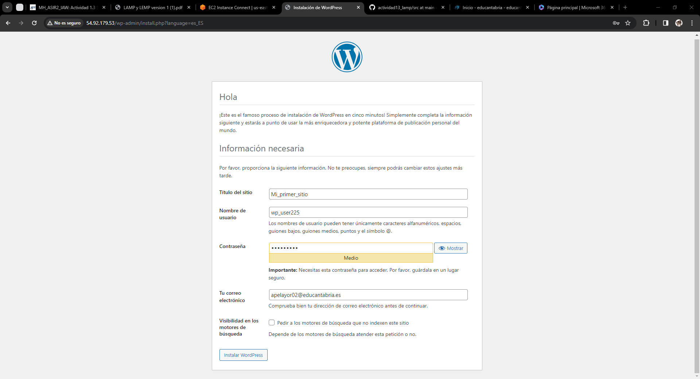

# actividad13_wordpress
## Ander Pelayo Remesal

1. Lo primero que tenemos que hacer es instalar unos archivos, para ello ejecutaremos el siguiente comando `apt install php-curl php-gd php-mbstring php-xml php-xmlrpc php-soap php-intl php-zip`

   

2. El siguiente paso sera crear la base de datos en mariaDB para wordpress para eso ejecutaremos el siguinte comando

   

3. Crearemos un usuario que sera el que tendremos en el propio wordpress

   

4. Tambien tendremos que volver a modificar el archivo de configuracion 000-default.conf, este archivo le modificamos en el archivo anterior

   

5. Ahora tendremos que avilitar un modulo de apache para el funcionamineto del mismo   

   

6. Tendremos tambien que instalar el `wget` para descargarnos un archivo de internet mas adelante

   

   

7. Ahora tendremos que descomprimir el archivo que nos hemos descargador para ello usaremos la herramienta unzip, que tambien nos tendriamos que descargar

   

   

8. Tendremos que mover los archivos comprimidos al directorio /var/www/html para ello usaremos la siguiente instruccion

   

9. Una vez realizados estos pasos solo tendremos que ir al navegador y pondremos la IP de nuestor servidor. Nos saldra una paguna como la que vemos a continuacion

   

10. Tendremos que rellenar los campos que se nos piden con los datos facilitados al comienzo de esta actividad

   

   

   

11. Finalmente rellenados todos los campos lo que obtendriamos seria el acceso al siguiente panel

